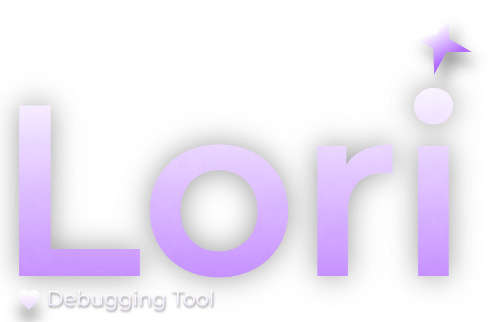
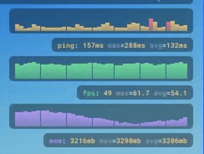
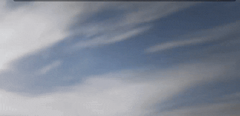
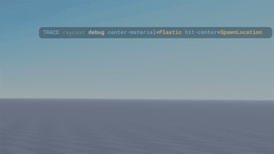

<p align="center">
  
</p>

<p align="center">
  Tiny Roblox debug UI for traces, live rows, timings, casts, and graphs.
</p>

<p align="center">
  <a href="#install">Install</a>
  ·
  <a href="#how-it-works">How It Works</a>
  ·
  <a href="#using-it">Using It</a>
  ·
  <a href="#graphs">Graphs</a>
  ·
  <a href="#api">API</a>
</p>

## What Is This?

Lori is a little client overlay for debugging while you play.

It is for the stuff you normally print, but want to actually see in-game:
FPS, current state, what part you are standing on, what a raycast hit, how long something took, memory, script activity, or any number you want graphed.

<table align="center">
  <tr>
    <td width="50%" align="center">
      
    </td>
    <td width="50%" align="center">
      
    </td>
  </tr>
  <tr>
    <td colspan="2" align="center">
      
    </td>
  </tr>
</table>

## Install

Put `Lori.rbxm` in `ReplicatedStorage/Packages/Lori`, then require it from a `LocalScript`.

```luau
local Lori = require(game.ReplicatedStorage.Packages.Lori)
```

For roblox-ts/npm:

```sh
npm install @kyrorblx/lori
```

```ts
import Lori = require("@kyrorblx/lori");
```

For Wally:

```toml
[dependencies]
Lori = "kyrorblx/lori@0.1.2"
```
*We're still waiting for uplift games to approve us :(, give us a bit for wally!*

Lori is client-side. Put your demo or setup code in `StarterPlayerScripts`, `StarterGui`, or another client place. Server scripts should not mount the overlay because the UI lives in `PlayerGui`.

## How It Works

Lori has two layers:

- `Lori.create()` makes an isolated client with its own rows, graphs, theme, config, and template providers.
- `Lori.trace(...)`, `Lori.mount(...)`, and the other direct `Lori.*` calls use one shared default client.

Use `Lori.create()` for real projects so different systems do not fight over one global overlay.

Mounting creates a `ScreenGui` under `PlayerGui`. After that, traces and graphs create compact UI rows inside the configured stack position. If you call a trace before mounting, Lori mounts itself automatically.

By default, `studioOnly = true`, so Lori does nothing in live published servers unless you pass `studioOnly = false`.

## Using It

Most of the time you want one Lori client:

```luau
local lori = Lori.create()

lori:mount(nil, {
	studioOnly = false,
	maxItems = 8,
})
```

Then send rows:

```luau
lori:success("demo", "loaded")
lori:warn("net", "retry", { count = 2 })
lori:trace("weapon", "fire", { ammo = 12 })
```

Rows are built from:

- `scope`: where it came from, like `weapon`
- `action`: what happened, like `fire`
- `fields`: extra values
- `tone`: color style, like `trace`, `success`, `warn`

The displayed row is basically `scope action key=value key=value`. Field order is alphabetical so rows do not jump around when tables are built in a different order.

Use these for events. If something changes constantly, use a keyed row or a watch.

## Keyed Rows

A normal trace makes a new row. A keyed row updates the same row.

```luau
lori:push({
	key = "player.ground",
	scope = "player",
	action = "standing",
	tone = "phase",
	sticky = true,
	fields = {
		part = "Baseplate",
	},
})
```

Push the same key again and it changes that row instead of adding another one.

This is useful for state, target, ammo, current room, current floor part, and anything else where there should only be one visible line.

Use `sticky = true` for rows that should stay until changed or dismissed. Without `sticky`, the row fades out after `duration` seconds.

## Watches

Watches are keyed rows where fields can be functions.

```luau
lori:watch("player.stats", {
	health = function()
		return math.floor(humanoid.Health)
	end,
	speed = function()
		return math.floor(root.AssemblyLinearVelocity.Magnitude)
	end,
})
```

Lori keeps refreshing the row. You can also push the same key later with different functions and it will use the new ones.

Watch fields are called with `pcall`, so one bad field shows `err` instead of killing the overlay. Use `options.interval` to control refresh rate:

```luau
lori:watch("player.stats", fields, {
	interval = 0.25,
	tone = "success",
})
```

## Timing

Use `time` when you want to know how long something took.

```luau
local done = lori:time("weapon", "raycast")
local result = workspace:Raycast(origin, direction, params)
done({ hit = result and result.Instance.Name or "none" })
```

There are also cast helpers:

```luau
lori:raycast("gun", origin, direction, params)
lori:spherecast("sensor", origin, radius, direction, params)
lori:blockcast("hitbox", cframe, size, direction, params)
```

They return the normal Roblox result, but Lori records timing for the perf rows.

`time` is best when you already own the code block. `measure` wraps a callback and rethrows errors after recording the time. Cast helpers are just convenience wrappers around `Workspace` casts.

## Graphs

Graphs are for any number over time.

Not just memory or FPS. Anything numeric works:
raycast time, casts per second, script activity, AI count, ping, queue size, damage, pathfinding time, network messages, whatever.

Create one:

```luau
local graph = lori:graph("ray ms", {
	unit = "ms",
	warnAt = 1,
	failAt = 3,
})
```

Push values:

```luau
graph:push(0.42)
```

That is it. Lori keeps the last samples and draws the columns.

Example idea for script activity:

```luau
local activity = lori:graph("activity", { unit = "/s", tone = "phase" })
local count = 0
local elapsed = 0

local function recordActivity()
	count += 1
end

game:GetService("RunService").Heartbeat:Connect(function(dt)
	elapsed += dt
	if elapsed >= 1 then
		activity:push(count / elapsed)
		count = 0
		elapsed = 0
	end
end)
```

Call `recordActivity()` wherever your system does work.

Graph options:

- `tone`: graph color
- `style`: currently only `bars`
- `unit`: text after the number, like `ms`, `fps`, `/s`
- `range`: fixed `{ min, max }`; without it Lori auto-ranges
- `warnAt`: column turns warn color at this value
- `failAt`: column turns error color at this value
- `format`: custom display function

The bar gradient uses the graph `tone` color. Change the tone or override that tone with `lori:setTheme(...)`.

Graphs keep a rolling sample window. If no fixed `range` is provided, Lori auto-ranges from visible samples and adds padding so small changes are readable.

Graph labels show the current value plus `min`, `max`, and `avg` for the visible window.

Hover a graph column to show a tooltip for that sample. While the tooltip is open, that graph visually pauses so the value does not move under your mouse. Moving away resumes it.

The performance template includes ping, FPS, and memory graphs by default.

## Speaking Of, The Performance Template!

Lori starts empty unless you ask for the template:

```luau
lori:mount(nil, {
	studioOnly = false,
	template = Lori.Templates.Performance,
})
```

That adds:

- FPS/frame row
- perf pressure row
- ping graph
- FPS graph
- memory graph

You can remove built-in template providers with `templateBlacklist`.

```luau
lori:mount(nil, {
	studioOnly = false,
	template = Lori.Templates.Performance,
	templateBlacklist = Lori.Templates.ItemBlacklister.New().Memory().FPS(),
})
```

That example keeps the frame/perf rows and ping graph, but removes the memory and FPS graphs.

Plain string tables also work:

```luau
lori:mount(nil, {
	template = Lori.Templates.Performance,
	templateBlacklist = { "MemGraph", "FpsGraph" },
})
```

Provider names:

- `Frame`
- `Pressure`
- `PingGraph`
- `FpsGraph`
- `MemGraph`

Use `Lori.Templates.Empty` if you want only your own rows.

## Theme

Themes are just colors.

```luau
lori:setTheme({
	warn = Color3.fromRGB(255, 180, 60),
	background = Color3.fromRGB(12, 12, 16),
})
```

Main color keys:

- `trace`, `phase`, `success`, `warn`, `error`
- `key`, `value`, `muted`
- `text`, `background`

## Config

Common options:

- `studioOnly`: only run in Studio
- `maxItems`: max trace rows
- `interval`: update delay in seconds, default `0.1`
- `minInterval`: lowest allowed update delay, default `0.04`
- `anchor`: stack position, default `tr`
- `rightOffset`, `leftOffset`, `topOffset`, `bottomOffset`
- `position`: legacy top-right offset alias
- `width`: max row width, `0` means automatic
- `fontSize`, `rowHeight`, `gap`, `padX`, `cornerRadius`
- `graphWidth`, `graphHeight`, `graphColumns`
- `motionTime`, `exitTime`, `fadeTime`
- `uiScale`, `scaleBaseWidth`, `minScale`, `maxScale`

Anchors:

- `tr` / `topRight` / `top-right`
- `tl` / `topLeft` / `top-left`
- `br` / `bottomRight` / `bottom-right`
- `bl` / `bottomLeft` / `bottom-left`

Bottom anchors stay pinned to the bottom and grow upward as rows appear.

`cornerRadius` can be a scale value like `0.3` or a pixel value like `6`. Rows, graph cards, graph labels, and tooltips all share the same radius.

You can pass config directly or under `config`; these are equivalent:

```luau
lori:mount(nil, { maxItems = 8 })
lori:mount(nil, { config = { maxItems = 8 } })
```

Viewport scaling changes the actual text size, row size, padding, and graph size together, so the text measurement stays correct.

## API

```luau
Lori.create(options?)

lori:mount(parent?, options?)
lori:trace(scope, action, fields?, duration?)
lori:phase(scope, action, fields?, duration?)
lori:success(scope, action, fields?, duration?)
lori:warn(scope, action, fields?, duration?)
lori:error(scope, action, fields?, duration?)

lori:push(event)
lori:watch(key, fields, options?)
lori:graph(name, options?)

lori:time(scope, action)
lori:measure(scope, action, callback)
lori:record(scope, action, elapsedMs, fields?)

lori:raycast(scope, origin, direction, params?)
lori:spherecast(scope, origin, radius, direction, params?)
lori:blockcast(scope, cframe, size, direction, params?)

lori:dismiss(key)
lori:clear()
lori:unmount()
lori:destroy()
```

Graph handles:

```luau
graph:push(value)
graph:rescale(factor)
graph:remove()
```

You can use the global `Lori.trace(...)` style too, but for real projects `Lori.create()` is cleaner.
